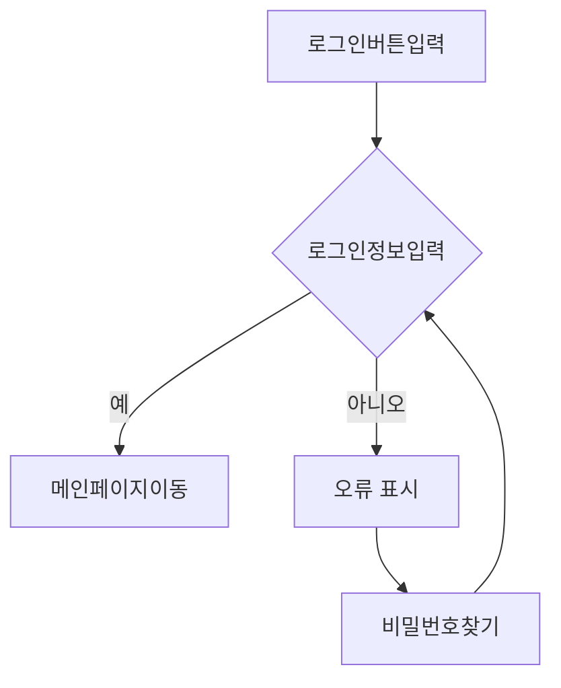
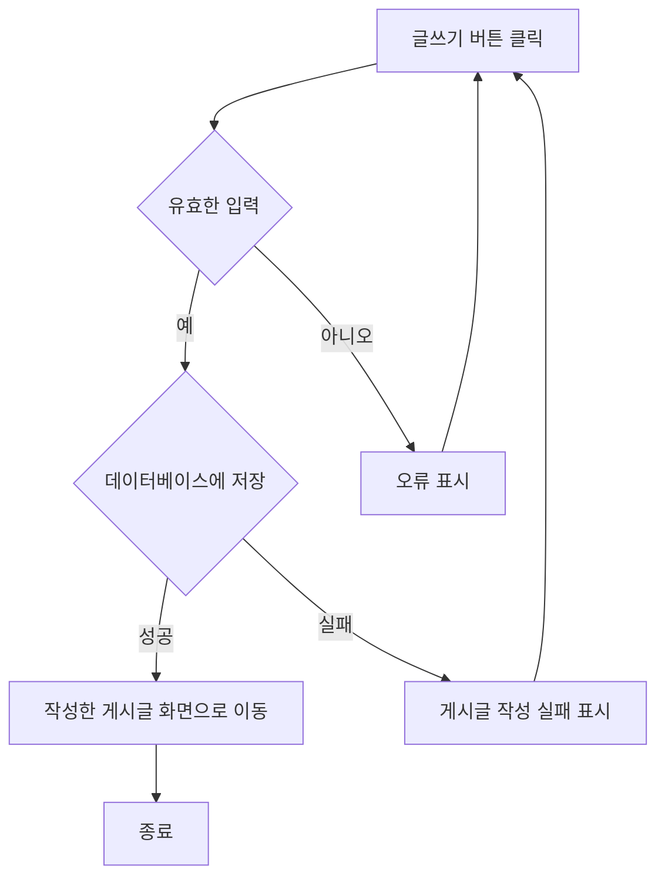
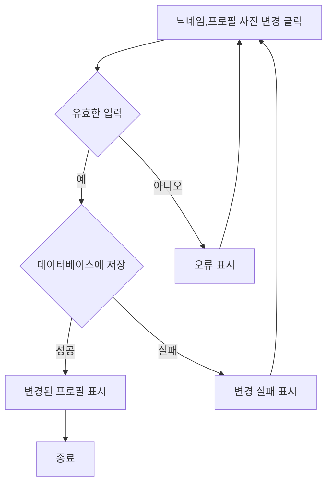
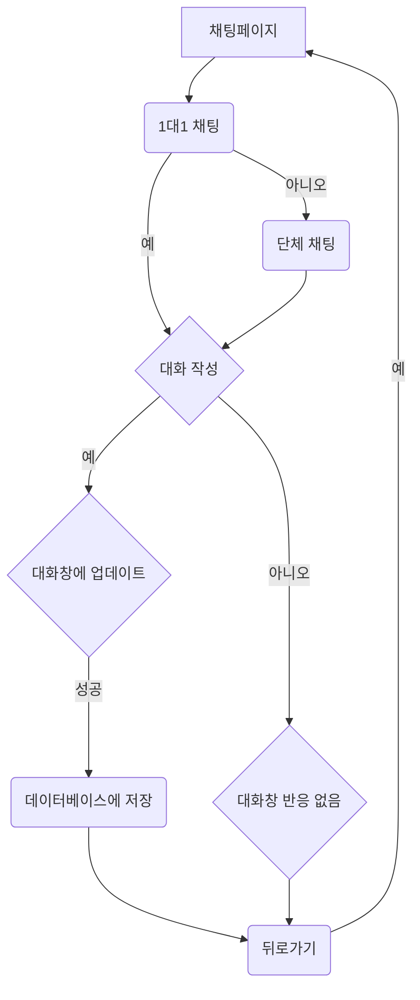
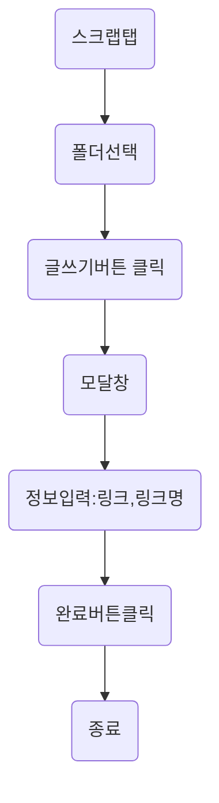
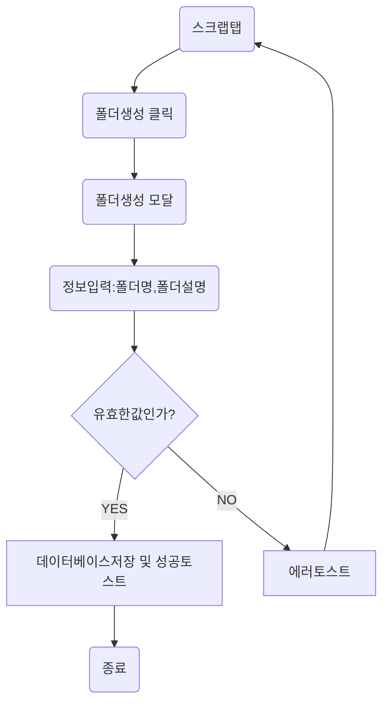

#### 1. 기능명: 로그인

- 기능 설명
  - 사용자가 자신의 정보로 로그인 할 수 있다.

```mermaid
  flowchart TD
    A[로그인버튼입력] --> B{로그인정보입력}
    B --> |예| C[메인페이지이동]
    B --> |아니오| D[오류 표시] --> E[비밀번호찾기]
    E --> B
```

#### 2. 기능명: 글 작성

- 기능 설명
  - 사용자가 자신의 글을 작성한다.

```mermaid
flowchart TD
    A[글쓰기 버튼 클릭] --> B{유효한 입력}
    B --> |예| C{데이터베이스에 저장}
    B --> |아니오| D[오류 표시]
    C -->|성공| E[작성한 게시글 화면으로 이동]
    C -->|실패| F[게시글 작성 실패 표시]
    D --> A
    E --> G[종료]
    F --> A
```

#### 3.기능명 : 닉네임,프로필 사진 변경

```mermaid
flowchart TD
    A[닉네임,프로필 사진 변경 클릭] --> B{유효한 입력}
    B --> |예| C{데이터베이스에 저장}
    B --> |아니오| D[오류 표시]
    C -->|성공| E[변경된 프로필 표시]
    C -->|실패| F[변경 실패 표시]
    D --> A
    E --> G[종료]
    F --> A

```

#### 4.기능명: 채팅

```mermaid
flowchart TD
    A[채팅페이지] --> B(1대1 채팅)
    B --> |아니오|C(단체 채팅)
    B --> |예|D{대화 작성}
    D --> |예|E{대화창에 업데이트}
    D --> |아니오|G{대화창 반응 없음}
    C --> D
    E --> |성공|p(데이터베이스에 저장)
    p --> Q
    G --> Q(뒤로가기)
    Q --> |예|A
```

#### 4.기능명: 스크랩

```mermaid
flowchart TD
    A(스크랩탭) -->
    B(폴더선택) -->
    C(글쓰기버튼 클릭) -->
    D(모달창) -->
    E(정보입력:링크,링크명) -->
    F(완료버튼클릭)-->
    H(종료)
```

```mermaid
flowchart TD
    A(스크랩탭) -->
    B(폴더생성 클릭) -->
    C(폴더생성 모달) -->
    D(정보입력:폴더명,폴더설명) --> E{유효한값인가?}
    E -->|YES| F[데이터베이스저장 및 성공토스트] --> H(종료)
    E -->|NO| G[에러토스트] --> A
```
