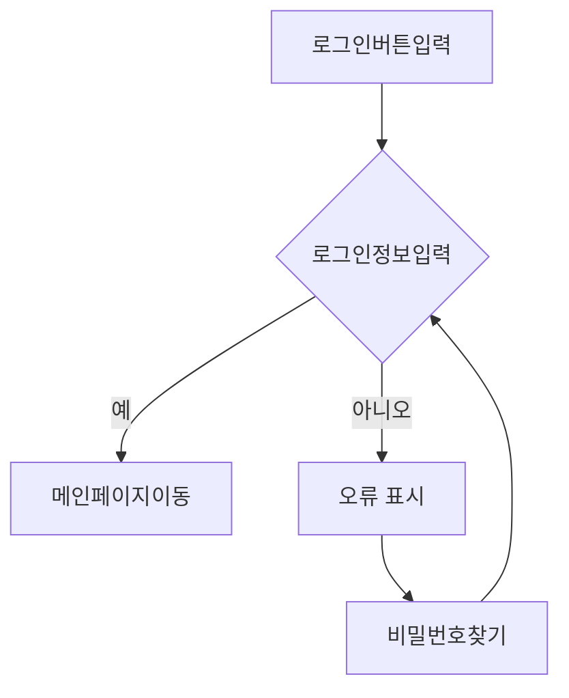
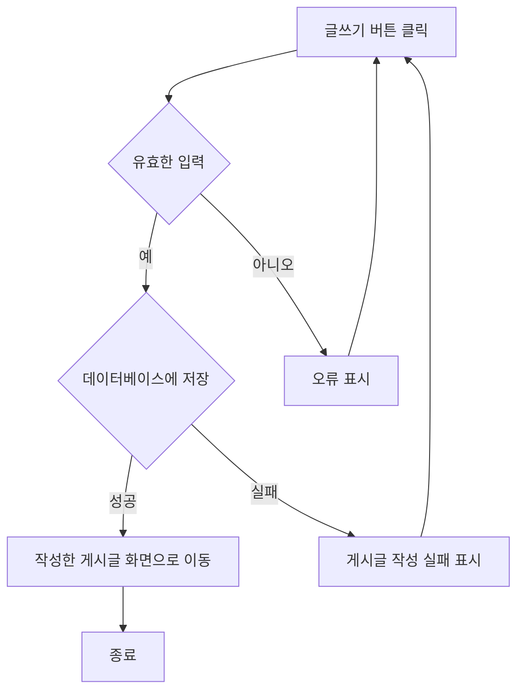
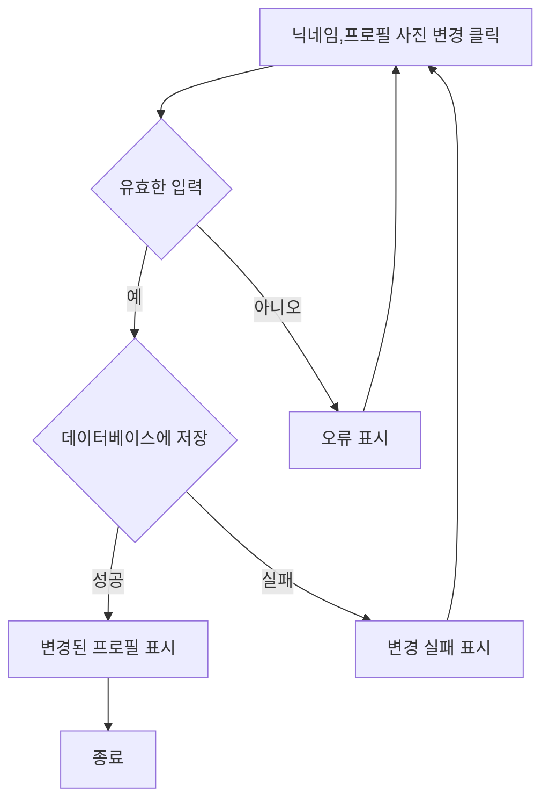
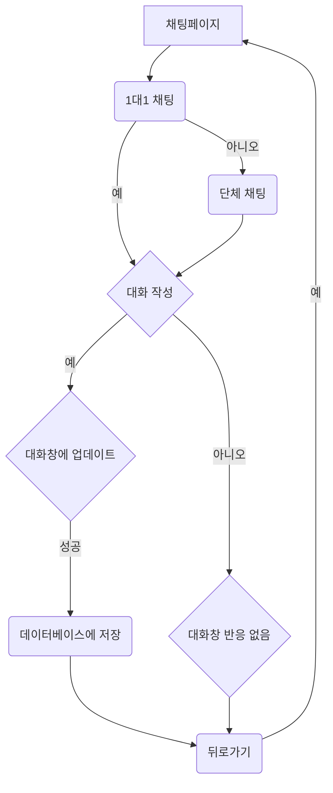
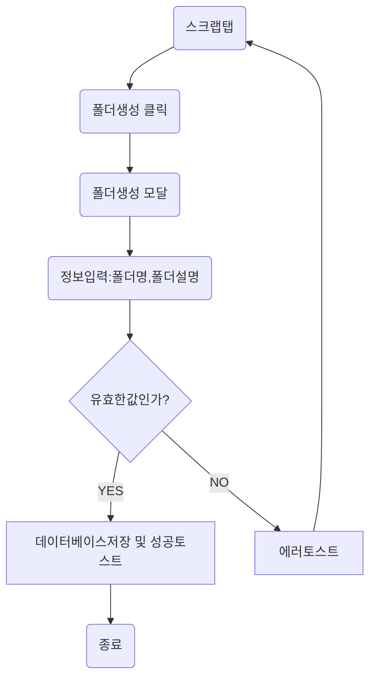

# 기능 및 유저플로우

#### 1. 기능명: 로그인

- 기능 설명: 사용자가 자신의 정보로 로그인 할 수 있다.

#### 2. 기능명: 글 작성

- 기능 설명: 사용자가 글을 작성하여 커뮤니티 게시판에 올릴 수 있다.

#### 3.기능명 : 닉네임,프로필 사진 변경

- 기능 설명: 사용자가 닉네임과 프로필 사진을 원하는대로 변경할 수 있다.

#### 4.기능명: 채팅

- 기능 설명: 사용자간 1:1채팅 및 그룹채팅이 가능하다.

#### 5.기능명: 스크랩폴더 생성

- 기능 설명: 스크랩한 링크를 모아둘 수 있는 폴더를 생성한다.

# 컴포넌트 관계도

#### 1. 로그인

#### 2. 글 목록, 글 작성

#### 3. 닉네임,프로필 사진 변경

#### 4. 채팅

#### 5.스크랩폴더 ,스크랩 게시글 정보

